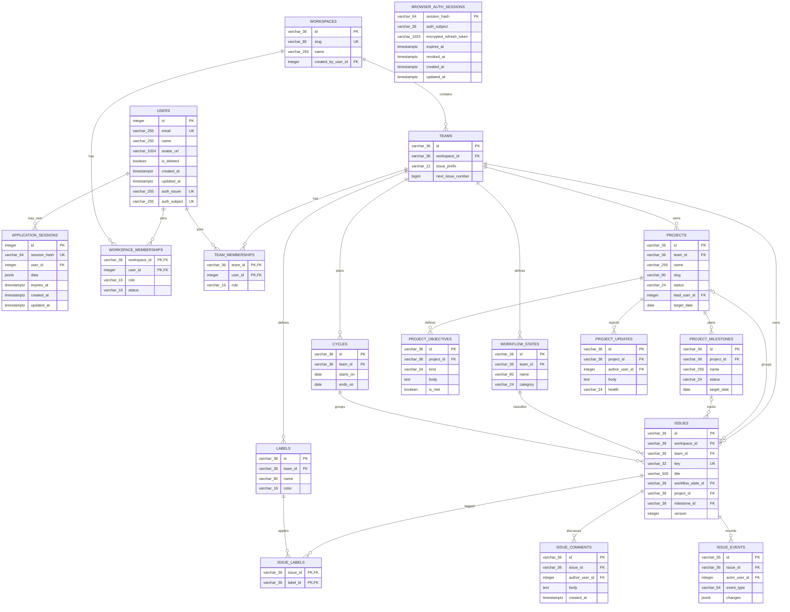

# 00 — Current implemented schema

This page is the clean implementation baseline for CommonPlan. It contains only the tables and columns that exist after applying the current migration heads:

- Auth DB: `20260910_0002`
- Business DB: `20260921_0010`

`IMPLEMENTED` means the table exists in PostgreSQL and has an active SQLAlchemy runtime model. `PROPOSED` means the entity belongs to the target product design but has no migration yet.

Each database also contains Alembic's `alembic_version` table. It is migration infrastructure rather than a CommonPlan domain entity and is therefore omitted from the ERDs.

## Auth database

`login_attempts` intentionally has no user foreign key because authentication can fail for an identifier that does not belong to an account. `external_identities` uses one composite unique constraint on `(provider, subject)`; the two `UK` badges denote participation in that constraint.

## Business database

The `(auth_issuer, auth_subject)` badges denote the partial composite unique index `ux_users_auth_identity`; neither column is independently unique. `browser_auth_sessions.auth_subject` logically refers to Auth `identity_users.id`, but PostgreSQL cannot enforce that cross-database relationship. It also has no direct foreign key to Business `users`.

## Implemented table catalog

| Database | Table | Runtime model | Responsibility |
| --- | --- | --- | --- |
| Auth | `identity_users` | `IdentityUser` | Canonical identity, password credential, activation state, and display identity |
| Auth | `external_identities` | `ExternalIdentity` | Google or future provider subjects linked to one identity |
| Auth | `refresh_tokens` | `RefreshToken` | Hashed refresh-token families, rotation, expiry, revocation, and replay response |
| Auth | `login_attempts` | `LoginAttempt` | Persistent identifier-based throttling and lockout state |
| Auth | `login_codes` | `LoginCode` | Single-use, short-lived Auth-to-BFF code exchange |
| Business | `users` | `User` | Application-facing user projection keyed by `(auth_issuer, auth_subject)` |
| Business | `application_sessions` | `ApplicationSession` | Durable product workflow state with Redis as an optional read-through cache |
| Business | `browser_auth_sessions` | `BrowserAuthSession` | Opaque-cookie lookup and encrypted refresh-token vault |
| Business | `workspaces` | `Workspace` | Top-level collaboration and authorization boundary |
| Business | `workspace_memberships` | `WorkspaceMembership` | Workspace role and active membership |
| Business | `workspace_invitations` | `WorkspaceInvitation` | Expiring invitations into a workspace and optional team |
| Business | `teams` | `Team` | Team scope, issue prefix, and atomic issue-number allocator |
| Business | `team_memberships` | `TeamMembership` | Team membership and lead/member role |
| Business | `workflow_states` | `WorkflowState` | Team-owned issue workflow states and categories |
| Business | `cycles` | `Cycle` | Non-overlapping team planning windows |
| Business | `labels` | `Label` | Team-owned issue labels |
| Business | `projects` | `Project` | Team-owned project brief, status, lead, and target date |
| Business | `project_objectives` | `ProjectObjective` | Ordered objectives and measurable success criteria |
| Business | `project_milestones` | `ProjectMilestone` | Ordered project delivery checkpoints with derived issue progress |
| Business | `project_updates` | `ProjectUpdate` | Authored project health and status history |
| Business | `issues` | `Issue` | Versioned team work item with an immutable key |
| Business | `issue_labels` | `IssueLabel` | Many-to-many issue label assignment |
| Business | `issue_comments` | `IssueComment` | Authored issue discussion with soft-delete timestamps |
| Business | `issue_events` | `IssueEvent` | Append-only issue change and collaboration history |

## Cross-database identity mapping

Auth DB is the source of truth for identity. On the first authenticated Business API request, a verified JWT supplies `(iss, sub)`. The Business API finds or provisions exactly one `users` row using `(auth_issuer, auth_subject)` and mirrors email, name, and avatar for product display.

Email is not the security join key. The current Business schema keeps it unique for projection consistency, while authentication and authorization continue to use the immutable issuer/subject pair.

## Proposed product schema

The following modules introduce `PROPOSED` entities and APIs. References to Business `users` reuse the implemented table above.

| Module | Proposed scope |
| --- | --- |
| [01 — Identity and profile](01-identity-profile.md) | User and notification preferences |
| [02 — Workspace and team](02-workspace-team.md) | Workspaces, teams, memberships, and invitations |
| [03 — Work planning](03-work-planning.md) | Implemented planning core; sub-issues and production pagination remain proposed |
| [04 — Views and notifications](04-views-notifications.md) | Saved views, inbox notifications, and aggregate read models |
| [05 — GitHub webhook](05-github-webhook.md) | Pull-request snapshots, issue links, and webhook delivery deduplication |
| [06 — Administration](06-administration.md) | Workspace settings, allowed domains, and audit events |

## Current design constraints

1. Business profile writes for email, name, and avatar must flow through Auth Service and then project through JWT claims.
2. `application_sessions` never authenticate an API caller; Business endpoints require a verified access JWT.
3. The browser receives an opaque HttpOnly session cookie, while the raw refresh token remains encrypted in `browser_auth_sessions`.
4. Supporting more than one accepted Auth issuer requires adding issuer context to `browser_auth_sessions`; `auth_subject` alone is currently valid because the deployment has one configured issuer.
