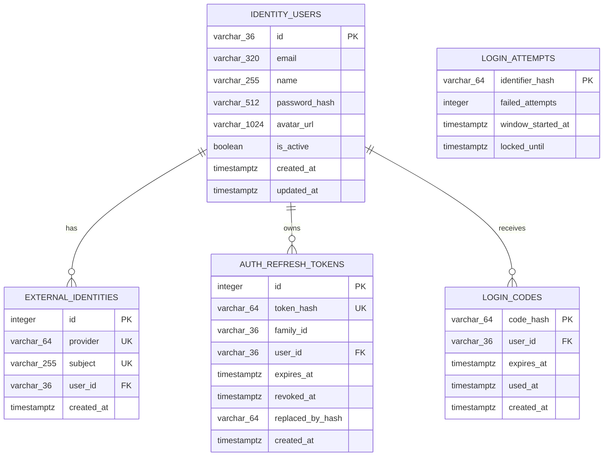
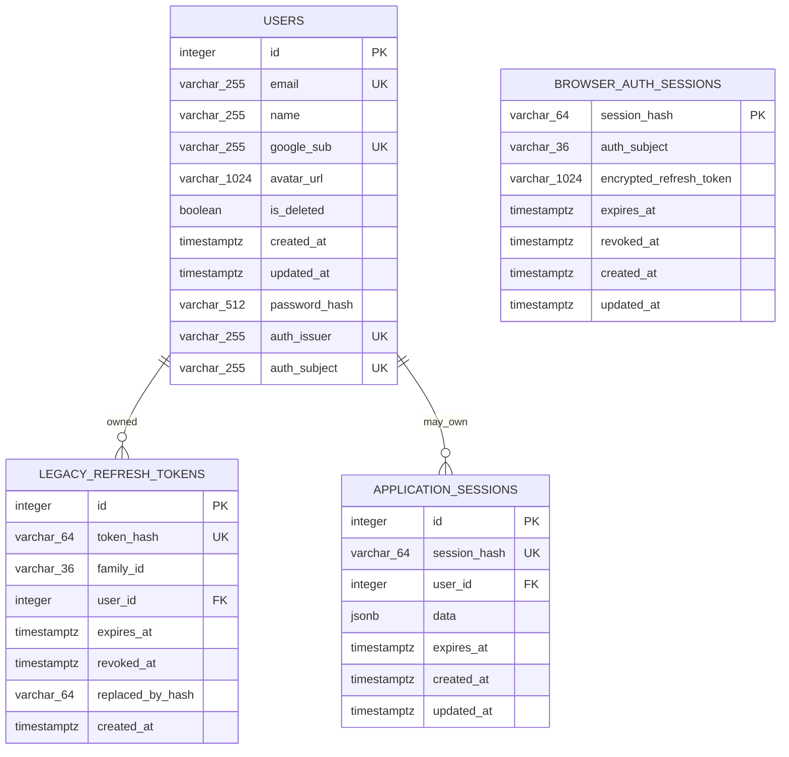

# 00 — Current database schema and migration map

This page is the reconciliation baseline for the design. It describes the schema that the checked-in Alembic migrations create today, then maps that physical schema to the SQLAlchemy runtime models and the target product design.

Status labels used throughout the data-model docs:

- **AS-IS / runtime** — created by a migration and mapped by the running application.
- **AS-IS / legacy** — still exists physically after all migrations, but current runtime models no longer use it.
- **PROPOSED** — part of the target design only; no migration or runtime model exists yet.

Each PostgreSQL database also contains its own Alembic-managed `alembic_version` table. It is migration infrastructure, not a CommonPlan domain entity, so it is listed here but omitted from the domain ERDs.

## Auth database — physical schema after migrations

Source: `auth_service/alembic/versions/20260905_0001_create_identity_store.py` and `20260910_0002_add_login_codes.py`.

All five tables are **AS-IS / runtime** and have corresponding classes in `auth_service/app/models.py`. `login_attempts` intentionally has no user foreign key because failed attempts can occur for an identifier that does not belong to an account. `EXTERNAL_IDENTITIES` has one composite unique constraint on `(provider, subject)`; the two `UK` labels above denote the columns participating in that constraint, not two independent unique constraints.

## Business database — physical schema after migrations

Source: all migrations in `backend/alembic/versions/` through `20260910_0005`.

`users`, `application_sessions`, and `browser_auth_sessions` are **AS-IS / runtime**. The Business database `refresh_tokens` table is **AS-IS / legacy**: migration `20260802_0003` created it before token ownership moved to Auth Service, but `backend/app/models.py` no longer maps or reads it.

The physical `users` table still contains **legacy** `google_sub` and `password_hash` columns and their historical indexes. Current Business ORM intentionally omits both because credentials and external identities now belong to Auth Service. The `(auth_issuer, auth_subject)` labels represent the partial composite unique index `ux_users_auth_identity`; neither column is independently unique.

`browser_auth_sessions.auth_subject` is a logical reference to Auth `identity_users.id`, not a database foreign key. It crosses databases. It also has no direct foreign key to Business `users`, so the diagram does not invent one.

## Migration-to-object inventory

| Database | Revision | Physical effect | Runtime mapping | Design disposition |
| --- | --- | --- | --- | --- |
| Business | `20260723_0001` | Creates `users`, including `google_sub` | `User` maps all except `google_sub` | Keep `users` as identity projection; retire `google_sub` after migration verification |
| Business | `20260801_0002` | Adds `users.password_hash` and case-insensitive email index | `User` omits `password_hash` | Retire credential column; Auth DB owns it |
| Business | `20260802_0003` | Creates `refresh_tokens` and `application_sessions` | Only `ApplicationSession` remains | Drop legacy Business `refresh_tokens` in a future cleanup migration; keep application sessions independent from auth |
| Business | `20260905_0004` | Adds `users.auth_issuer`, `users.auth_subject`, and partial unique index | `User` maps both | Keep as the cross-database identity key |
| Business | `20260910_0005` | Creates `browser_auth_sessions` | `BrowserAuthSession` | Keep as the BFF refresh-token vault |
| Auth | `20260905_0001` | Creates `identity_users`, `external_identities`, `refresh_tokens`, `login_attempts` | All four mapped | Keep; these are the Auth Service system of record |
| Auth | `20260910_0002` | Creates `login_codes` | `LoginCode` | Keep for one-time BFF login exchange |

## Physical table-to-design map

| Physical table | Current owner and purpose | Target module | Status |
| --- | --- | --- | --- |
| Auth `identity_users` | Login identity and credential owner | [Identity and profile](01-identity-profile.md) | Keep |
| Auth `external_identities` | Google/provider account links | [Identity and profile](01-identity-profile.md) | Keep |
| Auth `refresh_tokens` | Hashed refresh-token rotation ledger | [Identity and profile](01-identity-profile.md) | Keep |
| Auth `login_attempts` | Identifier-based throttling/lockout state | [Identity and profile](01-identity-profile.md) | Keep |
| Auth `login_codes` | Single-use browser/BFF code exchange | [Identity and profile](01-identity-profile.md) | Keep |
| Business `users` | Local projection keyed by `(auth_issuer, auth_subject)` | [Identity and profile](01-identity-profile.md) and membership FKs in later modules | Keep, restrict identity-owned writes |
| Business `refresh_tokens` | Superseded pre-extraction token ledger | No target module | Legacy; remove after rollback/data-retention decision |
| Business `application_sessions` | Durable product workflow/session data, optionally cached in Redis | [Identity and profile](01-identity-profile.md) | Keep; not an authentication credential |
| Business `browser_auth_sessions` | Opaque-cookie lookup and encrypted refresh-token vault | [Identity and profile](01-identity-profile.md) | Keep |

## Proposed tables that do not exist yet

All new product entities introduced in modules 02–06 are **PROPOSED**; references to Business `users` reuse the existing projection table. In module 01, `user_preferences` and `notification_preferences` are also **PROPOSED**. They must not be inferred from the current ORM or database until new migrations are added.

## Reconciliation findings

1. The previous design diagram omitted `login_attempts`, `application_sessions`, `browser_auth_sessions`, and the legacy Business `refresh_tokens` table. This page now accounts for all nine physical domain tables.
2. The database contains two different tables named `refresh_tokens`. Only the Auth DB version is active. Qualify the database whenever discussing this table.
3. The Business ORM is not a complete physical-schema description because it deliberately omits the legacy table and columns. Alembic migrations are the current physical source of truth.
4. `users.email` remains physically unique even though email is no longer the authentication join key. The target ownership model should make it a read-only projection; any future relaxation of that uniqueness needs an explicit migration.
5. `browser_auth_sessions` stores only `auth_subject`, while Business user identity uses `(auth_issuer, auth_subject)`. This works with one configured issuer, but supporting multiple issuers requires adding `auth_issuer` to the vault key/context.
