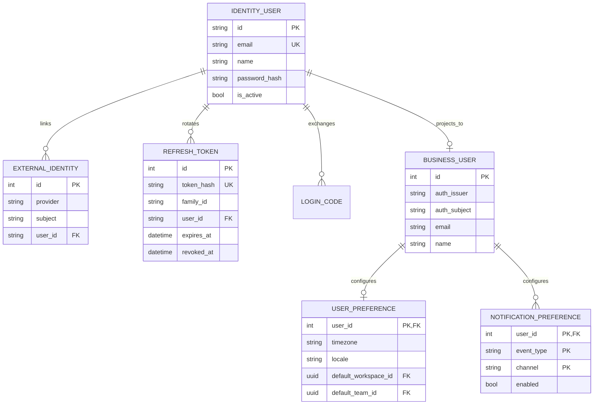

# 01 — Identity, profile, and personal settings

**UI:** Profile, Security & access, Connected accounts, account menu (KEY-3 pages 9, 10, 15). **Boundary:** Auth Service owns credentials and login identities; Business API owns product preferences and a read-side user mirror.

The identity-to-business-user line crosses databases and is **logical only**; no SQL foreign key crosses that boundary. `IDENTITY_USER`, `EXTERNAL_IDENTITY`, `REFRESH_TOKEN`, `LOGIN_CODE`, and the browser-auth-session vault already exist. `USER_PREFERENCE` and `NOTIFICATION_PREFERENCE` are proposed.

## Field contract

| Entity | Fields and PostgreSQL types | Invariants / UI use |
| --- | --- | --- |
| `identity_users` (existing, Auth DB) | `id varchar(36) PK`, `email varchar(320) UNIQUE`, `name varchar(255)`, `password_hash varchar(512) NULL`, `avatar_url varchar(1024) NULL`, `is_active boolean`, timestamps | Email/password and Google login resolve to one identity. Password hash never leaves Auth Service. |
| `external_identities` (existing, Auth DB) | `id integer PK`, `provider varchar(64)`, `subject varchar(255)`, `user_id varchar(36) FK`, `created_at` | `UNIQUE(provider, subject)`. Google shown under personal Connected accounts; not a workspace application. |
| `refresh_tokens` (existing, Auth DB) | `id integer PK`, `token_hash varchar(64) UNIQUE`, `family_id varchar(36)`, `user_id FK`, `expires_at`, `revoked_at`, `replaced_by_hash`, `created_at` | Hash-only storage and family-wide replay response. Raw refresh credential remains in the BFF vault, not browser storage. |
| `users` (existing, Business DB) | `id integer PK`, `auth_issuer`, `auth_subject`, mirrored `email`, `name`, `avatar_url`, `is_deleted`, timestamps | Add/verify `UNIQUE(auth_issuer, auth_subject)` in migration. Email is **not** a security key. Mirror fields are read-only in Business API. |
| `user_preferences` (P0) | `user_id integer PK/FK`, `timezone varchar(64)`, `locale varchar(16)`, `default_workspace_id uuid NULL`, `default_team_id uuid NULL`, `theme varchar(16)`, `updated_at` | Defaults must reference workspaces/teams the user can access; if membership is removed, clear the invalid default. Timezone drives due-date display, not stored issue dates. |
| `notification_preferences` (P1) | composite PK `(user_id, event_type, channel)`, `enabled boolean`, `updated_at` | Initial channel is in-app; email delivery can be added without changing the key. |

The Auth DB also retains `login_attempts` and one-time `login_codes` for security flows. The Business DB retains `browser_auth_sessions` and richer `application_sessions`; these are not substitutes for JWT authentication.

## API contract

| Endpoint | Purpose / access |
| --- | --- |
| `GET /api/v1/me` | JWT required; returns Business user, accessible workspaces, and preference defaults. Does not list all users globally. |
| `PATCH /api/v1/me/preferences` | Self-only; update timezone, locale, theme, default workspace/team. Reject inaccessible defaults. |
| `GET /api/v1/me/notification-preferences` / `PUT ...` | Self-only; effective notification switches. |
| `GET /auth/me` / `PATCH /auth/me` (proposed BFF/Auth Service flow) | Identity-owned display name, email and avatar. Email change needs verification before becoming the login identifier. |
| `GET /auth/identities`, `DELETE /auth/identities/{provider}` (proposed) | Self-only; list/disconnect Google. Reject disconnecting the last usable login method. |
| `GET /auth/sessions`, `DELETE /auth/sessions/{id}` (proposed) | Self-only; derive device sessions from refresh families/BFF sessions and revoke a selected session. |

The account-menu actions “Switch workspace” and “Log out” do not need their own product tables: workspace selection is client navigation plus a preference, while logout revokes the current BFF/auth session.

## Later, not silently in P0

Two-factor authentication, sign-in alert email, and agent personalization appear as settings destinations but have no agreed enrollment, recovery, or execution semantics yet. Do not add generic JSON blobs for credentials or AI behavior. Design those separately before exposing toggles that imply protection.
