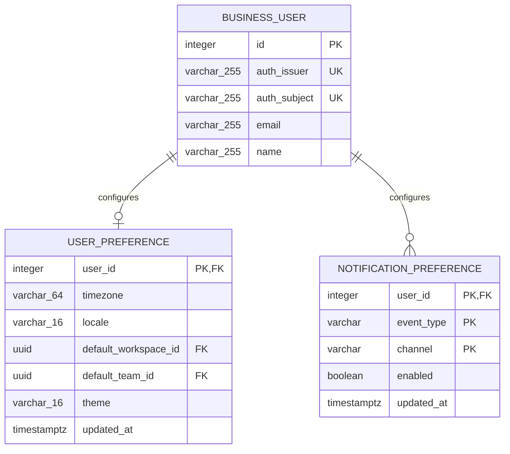

# 01 — Identity, profile, and personal settings

**UI:** Profile, Security & access, Connected accounts, account menu (KEY-3 pages 9, 10, 15). **Boundary:** Auth Service owns credentials and login identities; Business API owns product preferences and a read-side user projection.

The exact implemented tables and columns are shown in [00 — Current schema and migration map](00-current-schema-map.md). This page describes how those records participate in the identity workflow, then isolates the two proposed personal-settings tables.

## Implemented identity and session responsibilities

| Record | Database | Status | Responsibility |
| --- | --- | --- | --- |
| `identity_users` | Auth | AS-IS / runtime | Canonical identity, password hash, activation state, display identity |
| `external_identities` | Auth | AS-IS / runtime | Google/provider subject linked to an identity |
| `refresh_tokens` | Auth | AS-IS / runtime | Hash-only token-family rotation and replay detection |
| `login_attempts` | Auth | AS-IS / runtime | Login throttling/lockout keyed by hashed identifier |
| `login_codes` | Auth | AS-IS / runtime | Single-use, short-lived code exchanged by the web BFF |
| `users` | Business | AS-IS / runtime | Lazily provisioned product user projection keyed by `(auth_issuer, auth_subject)` |
| `application_sessions` | Business | AS-IS / runtime | Durable product workflow/session state; independent from login authentication |
| `browser_auth_sessions` | Business | AS-IS / runtime | Server-side vault for the encrypted raw refresh token; browser holds only an opaque HttpOnly cookie |

The Auth `identity_users` to Business `users` relationship is logical only: a JWT `(iss, sub)` causes the Business API to find or provision one local user. There is no cross-database foreign key.

## Target extension for personal settings

Only the two preference entities below are **PROPOSED**. The diagram intentionally does not repeat the implemented Auth and session tables from page 00, preventing current and future schemas from being mistaken for one migration state.

`BUSINESS_USER` above is the existing Business `users` table. The `UK` labels denote the two columns in its partial composite unique index.

## Proposed field contract

| Entity | Fields and PostgreSQL types | Invariants / UI use |
| --- | --- | --- |
| `user_preferences` (P0, PROPOSED) | `user_id integer PK/FK`, `timezone varchar(64)`, `locale varchar(16)`, `default_workspace_id uuid NULL`, `default_team_id uuid NULL`, `theme varchar(16)`, `updated_at` | Defaults must reference workspaces/teams the user can access; if membership is removed, clear the invalid default. Timezone drives due-date display, not stored issue dates. |
| `notification_preferences` (P1, PROPOSED) | composite PK `(user_id, event_type, channel)`, `enabled boolean`, `updated_at` | Initial channel is in-app; email delivery can be added without changing the key. |

## API contract

| Endpoint | Implementation status | Purpose / access |
| --- | --- | --- |
| `GET /api/v1/me` | PROPOSED | JWT required; returns Business user, accessible workspaces, and preference defaults. Does not list all users globally. |
| `PATCH /api/v1/me/preferences` | PROPOSED | Self-only; update timezone, locale, theme, default workspace/team. Reject inaccessible defaults. |
| `GET /api/v1/me/notification-preferences` / `PUT ...` | PROPOSED | Self-only; effective notification switches. |
| `GET /auth/me` | AS-IS / runtime | Return the current Auth identity. |
| `PATCH /auth/me` | PROPOSED | Update identity-owned display name, email, or avatar. Email change requires verification. |
| `GET /auth/identities`, `DELETE /auth/identities/{provider}` | PROPOSED | List/disconnect Google; reject disconnecting the last usable login method. |
| `GET /auth/sessions`, `DELETE /auth/sessions/{id}` | PROPOSED | Derive device sessions from refresh families/BFF sessions and revoke a selected session. |

The account-menu actions “Switch workspace” and “Log out” do not need their own product tables: workspace selection is client navigation plus a preference, while logout revokes the current browser/auth session.

## Required implementation reconciliation

1. Keep identity-owned email/name changes in Auth Service. The current Business `PATCH /users/{id}` can be overwritten by the next JWT projection and should not serve as the profile-edit endpoint.
2. Migration `20260919_0006` removes the superseded Business `refresh_tokens`, `users.password_hash`, and `users.google_sub` storage. Do not reintroduce credential fields into Business models.
3. Treat Business `users.email` as a read-only projection. It is physically unique today, but it is not the authentication join key.
4. If more than one Auth issuer will be accepted, add `auth_issuer` to `browser_auth_sessions`; `auth_subject` alone is only unambiguous under the current single-issuer deployment.

## Later, not silently in P0

Two-factor authentication, sign-in alert email, and agent personalization appear as settings destinations but have no agreed enrollment, recovery, or execution semantics yet. Do not add generic JSON blobs for credentials or AI behavior. Design those separately before exposing toggles that imply protection.
