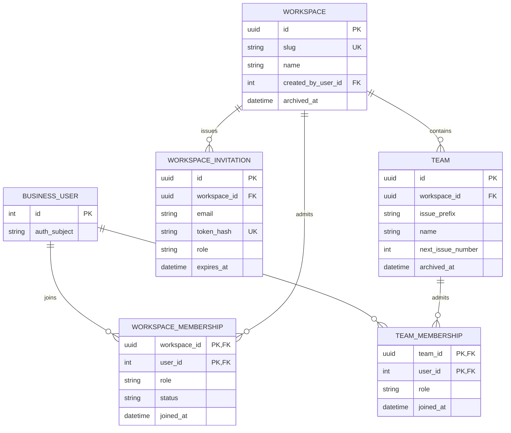

# 02 — Workspaces, teams, and membership

**UI:** Workspace switcher and team submenus (Overview, Issues, Cycles, Projects, Views), Team domain, Workspace settings, Teams & Members (KEY-3 pages 2, 8, 11, 12, 15).

## Field contract

| Entity | Fields and PostgreSQL types | Invariants / UI use |
| --- | --- | --- |
| `workspaces` | `id uuid PK`, `slug varchar(80) UNIQUE`, `name varchar(255)`, `description text NULL`, `created_by_user_id integer FK`, `created_at`, `updated_at`, `archived_at NULL` | Space/company container. Workspace name is editable; slug is a stable URL identifier. Archive is preferred to immediate destructive deletion. |
| `workspace_memberships` | composite PK `(workspace_id uuid, user_id integer)`, `role varchar(16)`, `status varchar(16)`, `joined_at`, `updated_at` | Role: `owner`, `admin`, `member`. Status: `active`, `suspended`. A workspace must retain at least one active owner. Invitations are not active memberships. |
| `workspace_invitations` | `id uuid PK`, `workspace_id FK`, `email varchar(320)`, `role`, `team_id uuid NULL`, `token_hash varchar(64) UNIQUE`, `invited_by_user_id integer FK`, `expires_at`, `accepted_at NULL`, `revoked_at NULL`, `created_at` | Hash invitation tokens. Optional team assignment is checked against the workspace. One active invite per `(workspace_id, lower(email))` is recommended via partial unique index. |
| `teams` | `id uuid PK`, `workspace_id uuid FK`, `name varchar(255)`, `description text NULL`, `issue_prefix varchar(12)`, `next_issue_number bigint`, `created_at`, `updated_at`, `archived_at NULL` | `UNIQUE(workspace_id, issue_prefix)` with uppercase canonical prefix. Increment `next_issue_number` under row lock when creating an issue. Prefix becomes immutable after first issue. |
| `team_memberships` | composite PK `(team_id uuid, user_id integer)`, `role varchar(16)`, `joined_at` | Role: `lead`, `member`. User must also have active membership in the parent workspace. Enforce with a scoped composite FK or a transactional service check. |

The team row is the **domain**, not a project-management object. Its Overview uses scoped counts; its submenu reads only that team's issues, cycles, projects, and views. A user in Team 1 and Team 2 sees both in the secondary navigation without switching Workspace.

## API contract

| Endpoint | Purpose / access |
| --- | --- |
| `GET /api/v1/workspaces` | Return only active memberships for the caller; drives workspace switcher. |
| `POST /api/v1/workspaces` | Create workspace and owner membership in one transaction. |
| `GET/PATCH /api/v1/workspaces/{workspaceId}` | Member read; admin/owner update workspace profile. |
| `GET/POST /api/v1/workspaces/{workspaceId}/teams` | Member list scoped to visible teams; admin create. |
| `GET/PATCH /api/v1/workspaces/{workspaceId}/teams/{teamId}` | Team member read; team lead or workspace admin update. Reject team ID from another workspace. |
| `GET /api/v1/workspaces/{workspaceId}/teams/{teamId}/overview` | Scoped project count, open issues, current cycle, recent issues. Derived query, no overview table. |
| `GET /api/v1/workspaces/{workspaceId}/members` | Admin or authorized member list for the Members settings page, including role and team names. |
| `GET/PUT/DELETE /api/v1/workspaces/{workspaceId}/members/{userId}` | Admin membership management; cannot remove the last owner. |
| `GET/PUT/DELETE /api/v1/workspaces/{workspaceId}/teams/{teamId}/members/{userId}` | Team lead/admin membership management; require parent workspace membership. |
| `POST /api/v1/workspaces/{workspaceId}/invitations` | Admin or permitted member invites; hash token, expiry, role bounds. |
| `POST /api/v1/invitations/accept` | Authenticated caller submits the invite token in the body; require their verified Auth Service email to match the invitation. |

`GET .../teams` should expose `my_role`, project/open-issue counts, and which team is the caller's default, but not every team's full roster unless authorized. Collection queries must include `workspace_id` and membership predicates in SQL, not just check after fetching.

## Access rules

- Workspace owner/admin can manage team definitions and memberships. Team lead can manage its own team membership and settings; ordinary members can read and work in their teams.
- Team-scoped resources return 404 if a caller tries to fetch an ID from another workspace. A user who belongs to the workspace but not the requested team gets 403 for team actions.
- Removing a user from a team does not erase their historical issue activity; assignments become unassigned or remain historical according to a separately specified removal policy. P0 recommendation: preserve history and clear current assignments in a transaction.
