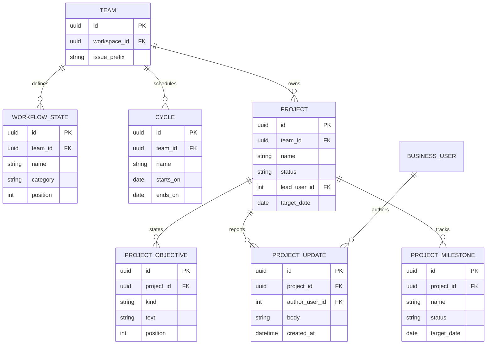
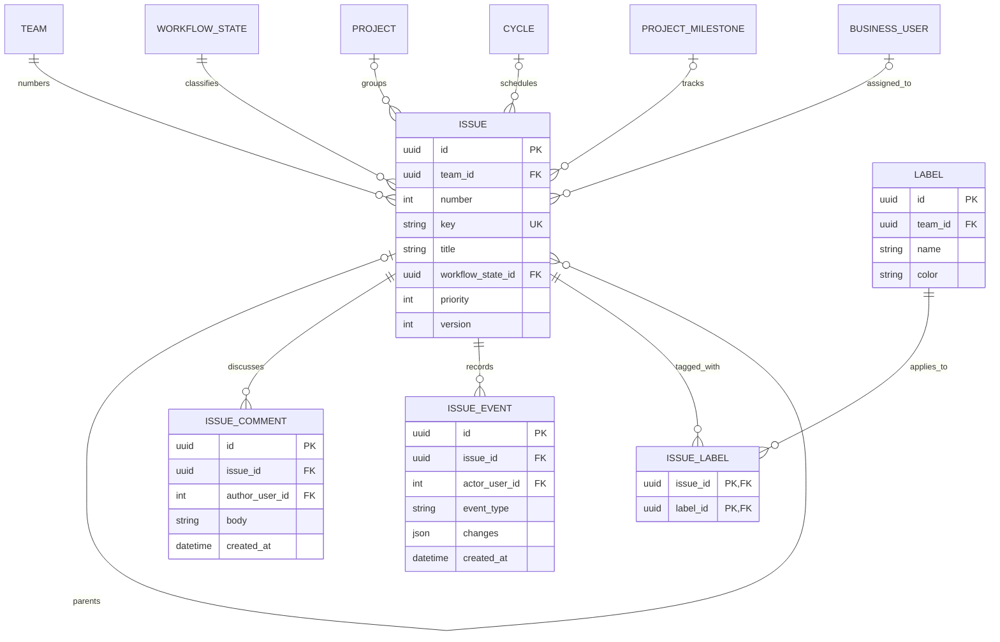

# 03 — Projects, cycles, issues, and activity

**UI:** My issues, issue creation/detail, project detail, team Issues/Cycles/Projects menus (KEY-3 pages 2, 4–6, 8). This is the core product domain.

## Project and cycle structure

| Entity | Fields and PostgreSQL types | Invariants / UI use |
| --- | --- | --- |
| `workflow_states` | `id uuid PK`, `team_id uuid FK`, `name varchar(80)`, `category varchar(24)`, `position integer`, `is_default boolean`, `created_at`, `updated_at` | Category: `backlog`, `todo`, `in_progress`, `done`, `canceled`. `UNIQUE(team_id, name)` and `UNIQUE(team_id, position)`; exactly one default creation state per team. Summary groups by category, not display name. |
| `cycles` | `id uuid PK`, `team_id uuid FK`, `name varchar(120)`, `starts_on date`, `ends_on date`, `created_at`, `updated_at`, `archived_at NULL` | Require `starts_on < ends_on` and no overlapping non-archived cycles within one team. The current cycle is derived from dates; allow planned future cycles. Avoid a stored counter that can diverge from issue assignments. |
| `projects` | `id uuid PK`, `team_id uuid FK`, `name varchar(255)`, `slug varchar(100)`, `summary text NULL`, `description text NULL`, `status varchar(24)`, `lead_user_id integer NULL FK`, `target_date date NULL`, timestamps, `archived_at NULL` | `UNIQUE(team_id, slug)`. Status: `planned`, `in_progress`, `paused`, `completed`, `canceled`. Lead must be an active team member. Summary and long description are distinct UI fields. |
| `project_objectives` | `id uuid PK`, `project_id uuid FK`, `kind varchar(24)`, `body text`, `position integer`, `is_met boolean`, timestamps | `kind` is `objective` or `success_criterion`. Ordered rows support the project brief/checklist; do not hide these in opaque JSON. |
| `project_updates` | `id uuid PK`, `project_id uuid FK`, `author_user_id integer FK`, `body text`, `health varchar(16) NULL`, `created_at`, `edited_at NULL` | Latest update is `ORDER BY created_at DESC, id DESC LIMIT 1`; retain author and history. |
| `project_milestones` | `id uuid PK`, `project_id uuid FK`, `name varchar(255)`, `description text NULL`, `status varchar(24)`, `target_date date NULL`, `position integer`, timestamps | Status: `planned`, `in_progress`, `completed`, `canceled`. Counts such as `12/12` are derived from linked issues, not stored percent. |

Projects can span cycles. The “Cycle 3” text on the project detail can be computed from its current issues; a fixed `projects.cycle_id` would incorrectly limit long-running projects.

## Issue and activity structure

`TEAM`, `WORKFLOW_STATE`, `PROJECT`, `CYCLE`, `PROJECT_MILESTONE`, and `BUSINESS_USER` are described above or in their owner module; the second diagram trims those boxes to keep the relationship graph readable.

| Entity | Fields and PostgreSQL types | Invariants / UI use |
| --- | --- | --- |
| `issues` | `id uuid PK`, `workspace_id uuid FK`, `team_id uuid FK`, `number bigint`, `key varchar(32)`, `title varchar(500)`, `description text NULL`, `workflow_state_id uuid FK`, `priority smallint`, `creator_user_id integer FK`, `assignee_user_id integer NULL FK`, `project_id uuid NULL FK`, `cycle_id uuid NULL FK`, `milestone_id uuid NULL FK`, `parent_issue_id uuid NULL FK`, `due_date date NULL`, `position numeric`, `version integer`, timestamps, `archived_at NULL` | `UNIQUE(team_id, number)` and `UNIQUE(workspace_id, key)`. Priority 0–4: none, low, medium, high, urgent. All optional references must share the issue's team; milestone must also share its project. Parent issue cannot equal self or form a cycle. |
| `labels` | `id uuid PK`, `team_id uuid FK`, `name varchar(80)`, `color varchar(16)`, `created_at` | `UNIQUE(team_id, name)`. Powers the “Backend” chip and team-level filtering. |
| `issue_labels` | composite PK `(issue_id, label_id)` | Issue and label must belong to the same team. |
| `issue_comments` | `id uuid PK`, `issue_id uuid FK`, `author_user_id integer FK`, `body text`, `created_at`, `edited_at NULL`, `deleted_at NULL` | Preserve thread chronology. Soft-delete body if needed while retaining event/audit history. |
| `issue_events` | `id uuid PK`, `issue_id uuid FK`, `actor_user_id integer NULL FK`, `event_type varchar(64)`, `changes jsonb`, `created_at` | Append-only timeline for status/assignee/priority/project/cycle/comment/PR changes. Event payload is versioned and contains changed field names, not credentials. |

Allocate `issues.number` by locking the owning `teams` row and incrementing `next_issue_number` in the same transaction. Store the resulting key as immutable text. Add indexes for `(team_id, workflow_state_id, position, id)`, `(assignee_user_id, archived_at, due_date)`, `(project_id, archived_at)`, `(cycle_id, archived_at)`, and `(issue_id, created_at)` on activity tables.

## API contract

| Endpoint | Purpose / access |
| --- | --- |
| `GET/POST /api/v1/workspaces/{w}/teams/{t}/cycles` | Team member list/create; cycle administration requires lead/admin. |
| `GET/POST /api/v1/workspaces/{w}/teams/{t}/projects` | Team member list/create. List includes status, lead, issue/milestone progress, target date. |
| `GET/PATCH /api/v1/workspaces/{w}/teams/{t}/projects/{p}` | Project detail/brief and metadata; lead/admin or authorized team member can update. |
| `GET/POST /api/v1/workspaces/{w}/teams/{t}/projects/{p}/objectives|milestones|updates` | Ordered objectives, milestone management, and authored status updates. |
| `GET/POST /api/v1/workspaces/{w}/teams/{t}/issues` | Cursor list with status, priority, assignee, project, cycle, label, due-date filters; create returns immutable key. |
| `GET/PATCH /api/v1/workspaces/{w}/issues/{key}` | Detail and mutation; response includes properties, labels, sub-issues, PR links. `PATCH` requires the last seen `version`; stale writes return 409. |
| `POST /api/v1/workspaces/{w}/issues/{key}/comments` | Add comment and timeline event transactionally. |
| `GET /api/v1/workspaces/{w}/issues/{key}/activity` | Cursor-paginated comments and events in chronological order. |
| `GET /api/v1/me/issues` | My issues across all teams the caller belongs to, with optional workspace filter. |

Creation takes a team from the route, **never** from an untrusted body field. Project/cycle/milestone/parent IDs are checked against that team before commit. Deleting a project should archive it, not cascade-delete its issues; existing issues can retain an archived project reference for history.
