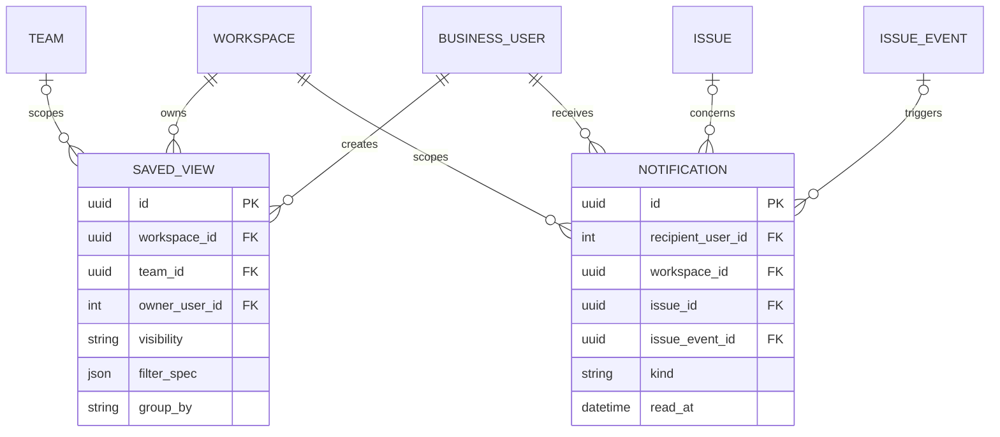

# 04 — Saved views, summary, search, and inbox

**UI:** My issues, Summary, saved View detail, Inbox, team Overview (KEY-3 pages 2, 3, 7, 8). These are read models over the work-planning tables; do not duplicate issue/project truth.



| Entity | Fields and PostgreSQL types | Invariants / UI use |
| --- | --- | --- |
| `saved_views` | `id uuid PK`, `workspace_id uuid FK`, `team_id uuid NULL FK`, `owner_user_id integer FK`, `name varchar(255)`, `visibility varchar(16)`, `filter_version smallint`, `filter_spec jsonb`, `group_by varchar(24)`, `sort_by varchar(32)`, `sort_direction varchar(4)`, timestamps, `archived_at NULL` | Visibility: `private`, `team`, `workspace`. `visibility='team'` requires `team_id`; private views may also be scoped to a team. Filter JSON is validated against a versioned schema; only allowlisted fields/operators can compile into SQL. Sharing a view never bypasses issue membership checks. |
| `notifications` | `id uuid PK`, `recipient_user_id integer FK`, `workspace_id uuid FK`, `issue_id uuid NULL FK`, `issue_event_id uuid NULL FK`, `actor_user_id integer NULL FK`, `kind varchar(48)`, `payload jsonb`, `dedupe_key varchar(160) UNIQUE`, `created_at`, `read_at NULL` | Append-on-event inbox item. The payload is a small display snapshot, not the authoritative issue state. On click, recheck current resource permission; a removed member must not read old issue content. |

Example `saved_views.filter_spec`:

```json
{
  "version": 1,
  "match": "all",
  "rules": [
    {"field": "status_category", "op": "in", "values": ["todo", "in_progress"]},
    {"field": "priority", "op": "in", "values": [3, 4]},
    {"field": "project_id", "op": "eq", "value": "project-uuid"}
  ]
}
```

Store the declarative filter, never raw SQL. Validate referenced project/team IDs against the view's workspace, and re-run authorization when executing the view. Add `GIN` search indexes for issue title/description only when the query design is fixed; start with a bounded, team-scoped title/key search.

## Derived read models; no new table in P1

| Surface | Query definition |
| --- | --- |
| My issues | Active, non-archived issues assigned to the caller in teams they can access; group by workflow category, stable `position, id` order. |
| Summary cards | For a selected workspace/team/cycle: open = categories other than `done`/`canceled`; in progress = `in_progress`; completed = `done` within the selected cycle/date range; overdue = open with `due_date < viewer-local today`. State counts and priority mix come from the same scoped issue set. |
| Recent activity | Latest permitted `issue_events` plus comments, ordered by timestamp/id. |
| Team Overview | Team-scoped project count, open issue count, current cycle, latest issues. |
| Project progress | `done` issue count divided by non-canceled issue count; milestone progress uses issues linked to that milestone. Define zero-denominator display as `0/0`, not a misleading percentage. |

The PDF's numbers are illustrative. Product analytics must use the definitions above consistently in cards, filters, and project progress. If aggregate queries later become expensive, add a materialized/cache read model with an explicit refresh policy; Redis is not the source of truth.

## API contract

| Endpoint | Purpose / access |
| --- | --- |
| `GET/POST /api/v1/workspaces/{w}/views` | List visible views; create a versioned filter. |
| `GET/PATCH/DELETE /api/v1/workspaces/{w}/views/{viewId}` | Owner/admin edit and archive; readers require view visibility **and** underlying team access. |
| `GET /api/v1/workspaces/{w}/views/{viewId}/issues` | Execute validated filter with cursor pagination; group/sort metadata returned separately. |
| `GET /api/v1/workspaces/{w}/summary?team_id=&cycle_id=` | Scoped counts, priority mix, and recent activity. Default scope must be explicit in response. |
| `GET /api/v1/me/inbox?workspace_id=&unread_only=` | Cursor-paginated notifications across accessible workspaces. |
| `POST /api/v1/me/inbox/{notificationId}/read` | Idempotently set `read_at`; self-only. |
| `GET /api/v1/search?q=&workspace_id=&team_id=` | Authorized key/title search; never search across inaccessible teams. |

Notification creation belongs in the same transaction as the issue/comment event or in a transactional outbox. A best-effort background task alone can lose inbox events after a process crash.
