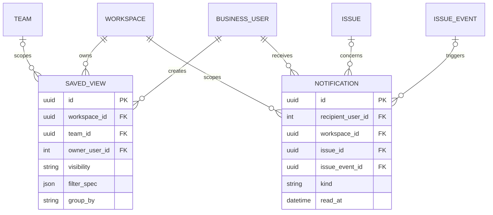

# 04 — Team Summary, saved views, search, and inbox

**UI:** My issues, Team Summary, saved View detail, Inbox, team Overview (KEY-3 pages 2, 3, 7, 8). These are read models over the work-planning tables; do not duplicate issue/project truth.

Summary is always scoped to one selected team. There is no workspace-wide or cross-team Summary page in the current design. The route carries both boundaries explicitly:

```text
/workspaces/{workspaceId}/teams/{teamId}/summary
```

The caller must be an active workspace member with access to the selected team. A workspace administrator may access all teams under the existing authorization policy, but the response still contains data from exactly one team.



| Entity | Fields and PostgreSQL types | Invariants / UI use |
| --- | --- | --- |
| `saved_views` | `id uuid PK`, `workspace_id uuid FK`, `team_id uuid NULL FK`, `owner_user_id integer FK`, `name varchar(255)`, `visibility varchar(16)`, `filter_version smallint`, `filter_spec jsonb`, `group_by varchar(24)`, `sort_by varchar(32)`, `sort_direction varchar(4)`, timestamps, `archived_at NULL` | Visibility: `private`, `team`, `workspace`. `visibility='team'` requires `team_id`; private views may also be scoped to a team. Filter JSON is validated against a versioned schema; only allowlisted fields/operators can compile into SQL. Sharing a view never bypasses issue membership checks. |
| `notifications` | `id uuid PK`, `recipient_user_id integer FK`, `workspace_id uuid FK`, `issue_id uuid NULL FK`, `issue_event_id uuid NULL FK`, `actor_user_id integer NULL FK`, `kind varchar(48)`, `payload jsonb`, `dedupe_key varchar(160) UNIQUE`, `created_at`, `read_at NULL` | Append-on-event inbox item. The payload is a small display snapshot, not the authoritative issue state. On click, recheck current resource permission; a removed member must not read old issue content. |

Example `saved_views.filter_spec`:

```json
{
  "version": 1,
  "match": "all",
  "rules": [
    {"field": "status_category", "op": "in", "values": ["todo", "in_progress"]},
    {"field": "priority", "op": "in", "values": [3, 4]},
    {"field": "project_id", "op": "eq", "value": "project-uuid"}
  ]
}
```

Store the declarative filter, never raw SQL. Validate referenced project/team IDs against the view's workspace, and re-run authorization when executing the view. Add `GIN` search indexes for issue title/description only when the query design is fixed; start with a bounded, team-scoped title/key search.

## Team Summary page contract

The Summary page combines default Jira-style visualizations with one shared, customizable issue filter. Every card, chart, attention list, and drill-down uses the same authorized team scope and filter specification.

### Supported filters

| Filter | Behavior |
| --- | --- |
| Cycle | One or more cycles, including “No cycle”; values must belong to the selected team |
| Project | One or more projects, including “No project”; values must belong to the selected team |
| Status | Workflow states or normalized categories: backlog, todo, in progress, done, canceled |
| Priority | None, low, medium, high, urgent |
| Assignee | One or more team members plus unassigned |
| Label | Match any/all selected team labels according to the filter operator |
| Date range | Bounds created/completed trend events; the response echoes the effective timezone and range |
| Due-date state | Not due, due soon, overdue, or no due date |
| Archive state | Excludes archived issues by default; explicit opt-in is required |
| Ownership preset | All team issues, my issues, or unassigned issues |

Filter state is encoded in URL query parameters so refresh, browser navigation, and shared links restore the page. “Reset” returns to the team default: active, non-archived issues with no project, cycle, assignee, label, or priority restriction. A date window may limit trend series, but must not silently change snapshot cards; the response describes the basis of every metric.

M4 implements immediate filtering. M6 lets a user persist the same validated filter grammar as a `saved_view`; saved filters never broaden team access.

### Default visualizations

| Visualization | Definition and interaction |
| --- | --- |
| Headline cards | Total matching, open, in progress, completed, overdue, and unassigned counts |
| Status distribution | Count by workflow category/state; selecting a segment applies that status filter |
| Priority distribution | Count by priority; selecting a bar applies that priority filter |
| Assignee workload | Matching open issues by assignee, including unassigned; selecting a person filters the issue result |
| Cycle progress | Done versus non-canceled issues for the selected/current cycle; clearly handles no current cycle |
| Project distribution | Matching issue count and completion ratio by project, including no-project issues |
| Created/completed trend | Time series within the effective date window and viewer timezone |
| Attention issues | Bounded lists for overdue, urgent, approaching-due, and unassigned work with authorized issue links |
| Recent activity | Latest permitted issue events/comments for the filtered team scope |

Clicking a chart segment updates the URL filter and opens or refreshes the matching issue drill-down. Empty teams, no current cycle, no projects, and zero-result filters render explicit empty states rather than misleading zero-percentage charts.

### Summary response shape

The aggregate endpoint returns one coherent document so all visualizations use the same transactionally consistent query definition:

```json
{
  "scope": {"workspace_id": "...", "team_id": "...", "timezone": "America/New_York"},
  "filters": {"version": 1, "match": "all", "rules": []},
  "headline_metrics": {},
  "status_distribution": [],
  "priority_distribution": [],
  "assignee_distribution": [],
  "cycle_progress": null,
  "project_distribution": [],
  "trend": {"from": "...", "to": "...", "buckets": []},
  "attention_issues": {},
  "recent_activity": []
}
```

The API may execute several scoped aggregate queries internally, but it must build them from one normalized filter object. Do not accept field names, operators, SQL fragments, or sort expressions outside the allowlist.

## Derived read models; no new table in P1

| Surface | Query definition |
| --- | --- |
| My issues | Active, non-archived issues assigned to the caller in teams they can access; group by workflow category, stable `position, id` order. |
| Team Summary | For one selected team: open = categories other than `done`/`canceled`; in progress = `in_progress`; completed = `done`; overdue = open with `due_date < viewer-local today`. All cards and visualizations compile from the same normalized filter. |
| Recent activity | Latest permitted `issue_events` plus comments, ordered by timestamp/id. |
| Team Overview | Team-scoped project count, open issue count, current cycle, latest issues. |
| Project progress | `done` issue count divided by non-canceled issue count; milestone progress uses issues linked to that milestone. Define zero-denominator display as `0/0`, not a misleading percentage. |

The PDF's numbers are illustrative. Product analytics must use the definitions above consistently in cards, filters, and project progress. If aggregate queries later become expensive, add a materialized/cache read model with an explicit refresh policy; Redis is not the source of truth.

## API contract

| Endpoint | Purpose / access |
| --- | --- |
| `GET/POST /api/v1/workspaces/{w}/views` | List visible views; create a versioned filter. |
| `GET/PATCH/DELETE /api/v1/workspaces/{w}/views/{viewId}` | Owner/admin edit and archive; readers require view visibility **and** underlying team access. |
| `GET /api/v1/workspaces/{w}/views/{viewId}/issues` | Execute validated filter with cursor pagination; group/sort metadata returned separately. |
| `GET /api/v1/workspaces/{w}/teams/{t}/summary` | Authorized Team Summary document. Accepts the supported filter grammar and echoes normalized scope/filters. |
| `GET /api/v1/me/inbox?workspace_id=&unread_only=` | Cursor-paginated notifications across accessible workspaces. |
| `POST /api/v1/me/inbox/{notificationId}/read` | Idempotently set `read_at`; self-only. |
| `GET /api/v1/search?q=&workspace_id=&team_id=` | Authorized key/title search; never search across inaccessible teams. |

Notification creation belongs in the same transaction as the issue/comment event or in a transactional outbox. A best-effort background task alone can lose inbox events after a process crash.
