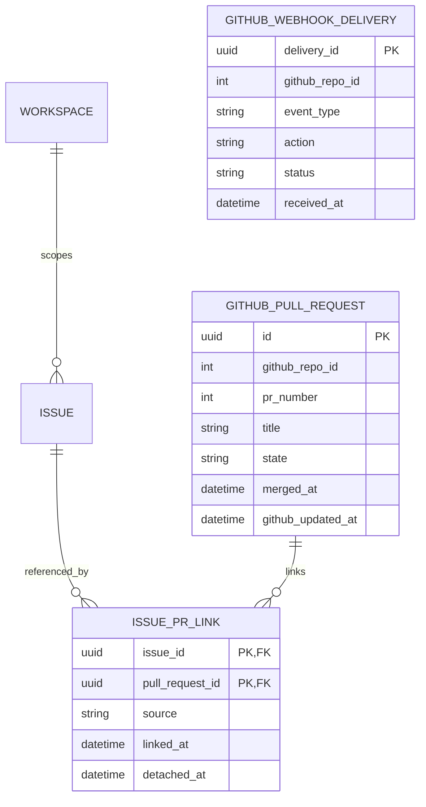

# 05 — GitHub pull-request links via webhook

**UI:** Issue Development section and Workspace Applications → GitHub (KEY-3 pages 4, 14). **Agreed scope:** PR title contains an exact issue key; no project/repository mapping, GitHub OAuth, or GitHub App installation in P1.

Deliveries are an independent inbox: a `ping` or unmatched event may have no PR row. Do not require a non-null PR foreign key on every delivery.

## Configuration, not an installation model

For the first workspace, server-side configuration can hold `GITHUB_WEBHOOK_SECRET`, `GITHUB_ALLOWED_ORG_ID`, `GITHUB_WORKSPACE_ID`, and optionally `GITHUB_HOOK_ID`. GitHub administrators configure an organization- or repository-level webhook URL and subscribe to `pull_request` events. The Workspace Applications page displays connection health, last delivery, the organization name, and setup instructions; it does not show the secret. A personal Google login under Connected accounts is unrelated.

If multiple CommonPlan workspaces later connect different GitHub organizations or need self-service setup, introduce `github_webhook_connections(workspace_id, github_org_id, hook_id, encrypted_secret_reference, enabled, last_delivery_at)` with `UNIQUE(github_org_id)` for unambiguous routing. Do **not** add it before that requirement exists.

## Persisted fields

| Entity | Fields and PostgreSQL types | Invariants / UI use |
| --- | --- | --- |
| `github_pull_requests` | `id uuid PK`, `github_repo_id bigint`, `github_repo_full_name varchar(255)`, `pr_number integer`, `title text`, `html_url text`, `state varchar(16)`, `is_draft boolean`, `merged_at timestamptz NULL`, `github_updated_at timestamptz`, `last_received_at timestamptz`, `created_at`, `updated_at` | `UNIQUE(github_repo_id, pr_number)`. Repository ID + PR number is identity; repo name can change. State displayed as open, closed, or merged (`merged_at` wins over closed). No repo-to-project FK. |
| `issue_pr_links` | composite PK `(issue_id uuid, pull_request_id uuid)`, `source varchar(24)`, `linked_at`, `detached_at NULL` | `source='title_key'` in P1. Current link has `detached_at IS NULL`. An edited title can detach an old link and attach a new one. Keep history for audit. |
| `github_webhook_deliveries` | `delivery_id uuid PK`, `github_repo_id bigint NULL`, `event_type varchar(40)`, `action varchar(40) NULL`, `payload jsonb NULL`, `status varchar(16)`, `received_at`, `processed_at NULL`, `error_code varchar(80) NULL` | Deduplicate `X-GitHub-Delivery`. If processing asynchronously, retain a minimal payload until processed, then purge after a short retention window. Never store the webhook secret. Status: `pending`, `processed`, `failed`, `ignored`. |

## Exact match and event lifecycle

1. `POST /webhooks/github` verifies `X-Hub-Signature-256` over the **raw body** with constant-time comparison, checks the allowed GitHub organization/hook, and persists the delivery ID before processing. A bad signature gets 401; an unknown source is rejected.
2. On `pull_request` `opened`, `edited`, `reopened`, `closed`, or draft-status changes, upsert the PR snapshot. Extract all distinct exact keys matching registered team prefixes plus `-` plus digits. `KEY-3` must not match `KEY-31`; branch names and PR bodies are ignored.
3. For each key found **in the configured workspace**, attach the PR if the issue exists. On title edit, detach links whose keys disappeared and attach new matches. A title with no matching issue leaves the PR unlinked. A title containing two valid issue keys can link to both.
4. Use the PR's GitHub `updated_at` to guard against stale out-of-order deliveries. Duplicate delivery IDs are idempotent. Recalculate the visible PR status from the newest accepted snapshot.
5. The issue detail loads active links and displays repository, PR number/title, URL, draft/open/closed/merged state, and why it linked (`title_key`).

The first implementation links **future webhook events only**. Existing PRs require a separate backfill job/API credential. GitHub does not automatically redeliver failed deliveries, so monitor failures and support manual redelivery; a durable delivery row makes internal reprocessing possible after a successful receipt.

## API contract

| Endpoint | Purpose / access |
| --- | --- |
| `POST /webhooks/github` | Exempt from user JWT, but requires valid GitHub signature, source allowlist, and delivery deduplication. Respond quickly after durable receipt. |
| `GET /api/v1/workspaces/{w}/integrations/github` | Workspace admin view of configured organization, webhook health, last event, and setup state. Never return secret. |
| `GET /api/v1/workspaces/{w}/issues/{key}/pull-requests` | Authorized issue reader; current linked PRs from the local snapshot. |

There is deliberately no `POST /api/v1/.../projects/{projectId}/github-mapping` and no GitHub account connection flow in P1.
