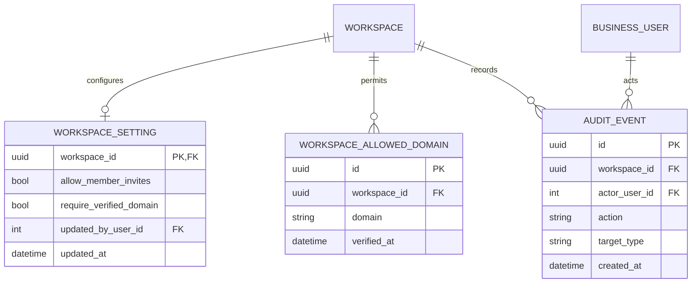

# 06 — Workspace administration and future settings

**UI:** Personal/Workspace settings split; Workspace, Teams, Members, Security, API, Applications, Billing, Import & export (KEY-3 pages 9–13). Settings is reached from the account menu, not a permanent main-navigation item. Personal identity/notifications live in [module 01](01-identity-profile.md); teams/members in [module 02](02-workspace-team.md); GitHub in [module 05](05-github-webhook.md).

## Core workspace settings

| Entity | Fields and PostgreSQL types | Invariants / UI use |
| --- | --- | --- |
| `workspace_settings` (P0) | `workspace_id uuid PK/FK`, `allow_member_invites boolean`, `require_verified_domain boolean`, `updated_by_user_id integer FK`, `updated_at` | The Workspace settings toggles. Turning on domain restriction requires at least one verified allowed domain. Workspace profile name/description remain columns on `workspaces`. |
| `workspace_allowed_domains` (P0 only if domain restriction ships) | `id uuid PK`, `workspace_id uuid FK`, `domain varchar(253)`, `verified_at timestamptz NULL`, `created_at` | `UNIQUE(workspace_id, lower(domain))`. Do not treat a typed domain as verified; the verification method needs its own security design. |
| `audit_events` (P1 security) | `id uuid PK`, `workspace_id uuid FK`, `actor_user_id integer NULL FK`, `action varchar(80)`, `target_type varchar(64)`, `target_id varchar(128)`, `request_id varchar(80)`, `details jsonb`, `created_at` | Append-only administrator audit log. Redact credentials, tokens, secrets, and raw webhook payloads from `details`; retention and export policy must be set. |

Workspace deletion is intentionally **not** a cascading SQL delete button. It requires a separate retention/export policy, owner confirmation, revocation of integrations, and a background deletion job. Until those requirements exist, the UI should not offer a functioning permanent-delete action.

## Administration destinations and model ownership

| UI destination | Data structure / owner | Current design decision |
| --- | --- | --- |
| Security — SSO | Future `sso_connections` in **Auth Service**, keyed to workspace; issuer, provider metadata, enabled state, verified domains | Not in P0: SSO enrollment, recovery, and lockout behavior are unspecified. Do not create a boolean that falsely implies enforcement. |
| Security — allowed domains | `workspace_allowed_domains` plus `workspace_settings.require_verified_domain` | Ship only with real domain verification and invitation-policy tests. |
| Security — audit log | `audit_events` in Business DB, with identity/auth security events forwarded from Auth Service | P1 after retention/redaction rules. |
| API — personal keys | Future hashed `api_credentials` in Auth Service with owner, scopes, expiry, revocation, last-used | Existing JWT guard does not yet accept API keys. Needs a separate credential and scope specification. Never store raw keys after issuance. |
| API — workspace webhooks | Future `outbound_webhook_subscriptions` and `outbound_webhook_deliveries` in Business DB | These are **CommonPlan → customer** events, separate from the inbound GitHub webhook. Need event catalog, secret rotation, retries, and SSRF protections before building. |
| Applications — GitHub | Service config plus `github_pull_requests`, `issue_pr_links`, `github_webhook_deliveries` | P1 signed inbound webhook. No installed-OAuth-app table or user Connected-account record. |
| Billing | Future provider-backed billing account, subscription, invoice references | No plan, payment provider, tax, or seat-billing rules in KEY-3. Keep it a design destination; do not invent chargeable records yet. |
| Import & export | Future `data_transfer_jobs(id, workspace_id, kind, format, status, blob_ref, requested_by, started_at, finished_at, error_code)` | Job metadata can be designed now, but importer mapping, file retention, and export privacy rules need a separate spec. |
| Agent personalization | Future user/workspace policy model | No agent capabilities, permissions, or preference meanings agreed yet. Do not store unvalidated arbitrary agent instructions in P0. |

## API contract

| Endpoint | Purpose / access |
| --- | --- |
| `GET/PATCH /api/v1/workspaces/{w}/settings` | Member read, admin update for explicit P0 settings. Response includes effective policy and who changed it. |
| `GET/POST/DELETE /api/v1/workspaces/{w}/allowed-domains` | Admin only; domain verification workflow required before enforcement. |
| `GET /api/v1/workspaces/{w}/audit-events` | Admin only, cursor paginated and redacted. P1. |
| `GET /api/v1/workspaces/{w}/integrations/github` | Admin setup/health view; defined in module 05. |

All future settings routes must live on the authenticated business router with an explicit role dependency. The inbound GitHub webhook is the signed non-JWT exception; outbound customer webhooks would be emitted by our service, not accepted as user actions.
