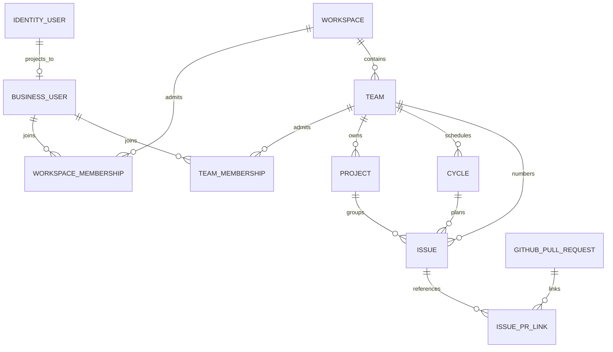

# CommonPlan data model and API design

This package contains the implemented schema baseline and the target product schema. [00 — Current implemented schema](00-current-schema-map.md) reflects the current migration heads. Modules 01–06 translate the [16-page KEY-3 UI specification](https://github.com/wangd606/commonplan-web/blob/codex/KEY-14-import-web/output/pdf/KEY-3-zhitong-ui-design.pdf) into bounded contexts.

Delivery order, exit criteria, and local verification are documented in the [CommonPlan implementation milestones](../implementation/milestones.md).

Use these labels when comparing code and design: **IMPLEMENTED** exists in both migrations and runtime ORM; **PROPOSED** has no migration yet.

## Domain boundaries

`IDENTITY_USER` is in the Auth Service PostgreSQL database; `BUSINESS_USER` and all other entities are in the Business PostgreSQL database. The cross-database line is a logical mapping by `(auth_issuer, auth_subject)`, **not a foreign key**. The diagrams in the module pages use the current `users.id` integer key and proposed UUID keys for new product resources.

## Modules and UI coverage

| Module | Detailed schema and API | KEY-3 views | Delivery |
| --- | --- | --- | --- |
| Implemented schema | [00 — Current implemented schema](00-current-schema-map.md) | N/A | Current migration heads |
| Identity and personal settings | [01 — Identity and profile](01-identity-profile.md) | 9, 10, 15 | Existing auth + P0 corrections; optional controls later |
| Workspaces, teams, access | [02 — Workspace and team](02-workspace-team.md) | 2, 8, 11, 12 | P0 |
| Work planning | [03 — Projects, cycles, issues](03-work-planning.md) | 2, 4, 5, 6, 8 | P0 |
| Team Summary, views and inbox | [04 — Team Summary, views, inbox](04-views-notifications.md) | 2, 3, 7 | Summary M4; views/inbox M6 |
| GitHub PR linking | [05 — GitHub webhook](05-github-webhook.md) | 4, 14 | P1 |
| Administration | [06 — Administration](06-administration.md) | 9–13, 15 | Core settings P0; advanced controls later |
| Visual design system | No persistence | 1, 16 | Web-only |

`P0` is the first useful multi-team product; `P1` completes the depicted collaboration loop. “Later” means the UI names a capability but does not yet specify enough behavior to justify a production table or endpoint.

## Feature traceability

Paths in this matrix omit the `/api/v1` prefix unless explicitly shown; the GitHub webhook and BFF auth routes are separate entry points.

| Design feature | Owning records | Read/write API or projection |
| --- | --- | --- |
| Team 1 / Team 2 secondary menu and Team Overview | `teams`, `team_memberships`, scoped issue/project counts | `GET /workspaces/{w}/teams`, `GET .../teams/{t}/overview` |
| Workspace switcher and member list | `workspaces`, `workspace_memberships`, `workspace_invitations` | `GET /workspaces`, `GET/PUT .../members` |
| My issues and create issue | `issues`, `workflow_states`, `labels` | `GET /me/issues`, `POST .../teams/{t}/issues` |
| Issue properties and sub-issues | `issues` foreign keys and `parent_issue_id` | `GET/PATCH .../issues/{key}` |
| Issue activity and comments | `issue_events`, `issue_comments` | `GET .../activity`, `POST .../comments` |
| Project brief, objectives, updates, milestones | `projects`, `project_objectives`, `project_updates`, `project_milestones` | `GET/PATCH .../projects/{p}`, nested update APIs |
| Cycles menu and issue planning | `cycles`, `issues.cycle_id` | `GET/POST .../cycles`, issue filter/update |
| Saved view and filters | `saved_views` + authorized issue query | `GET/POST .../views`, `GET .../views/{id}/issues` |
| Team Summary, customized filters, and default visualizations | Team-scoped aggregates over authorized issues/events using the shared filter grammar | `GET .../teams/{t}/summary`; no summary table |
| Inbox and unread state | `notifications` | `GET /me/inbox`, `POST .../read` |
| Personal profile, Google identity, password/sessions | Auth Service tables; Business `users` mirror | BFF/Auth Service identity and session endpoints |
| Personal timezone/default team/notification switches | `user_preferences`, `notification_preferences` | `PATCH /me/preferences`, notification-preference APIs |
| Workspace profile and invite/domain rules | `workspaces`, `workspace_settings`, `workspace_allowed_domains` | `GET/PATCH .../settings`, allowed-domain APIs |
| GitHub PR auto-linking | `github_pull_requests`, `issue_pr_links`, `github_webhook_deliveries` | Signed `POST /webhooks/github`, issue PR read API |
| SSO, API keys, billing, import/export, agent settings | Future bounded contexts, not implied by a visual menu | Separate specification before writable endpoints |

## Assumptions to confirm

1. A user may join multiple workspaces and multiple teams in each workspace. Team membership requires workspace membership.
2. A project belongs to **exactly one team**. A project may span several cycles; issues, not projects, are assigned to a cycle. The “Cycle 3” project detail is a derived current/most-relevant cycle, not a permanent `projects.cycle_id`.
3. Each team has a workspace-unique issue prefix such as `KEY`. Its prefix stops changing after the first issue is created. `KEY-31` remains immutable even if team display name changes.
4. Team members can read that team's projects and issues. Workspace admins can administer all teams. Private projects and guests are outside P0.
5. GitHub integration is a signed webhook configured on GitHub, not GitHub OAuth or an installed GitHub App. A single configured GitHub organization maps to one workspace in P1; there is no repository/project mapping.

If cross-team projects, guest access, or one GitHub organization shared by multiple workspaces are required, the corresponding module needs an explicit policy revision before migrations.

## Storage and API conventions

- New product tables use UUID primary keys; existing `users.id` remains integer. All times are `timestamptz` UTC. Use `date` for due/target dates. Store long-form descriptions as Markdown text; sanitize when rendering.
- Every table has `created_at`; mutable tables also have `updated_at`. Archive product objects with `archived_at` where appropriate. Avoid cascading deletion of business history when removing a membership.
- Enforce scope with foreign keys, unique constraints, and service checks. In particular, an issue's project, cycle, workflow state, and milestone must belong to its team. Composite foreign keys can enforce same-team references where practical.
- All `/api/v1/*` business routes use the existing JWT guard, then workspace/team authorization. Unauthenticated requests return 401; authenticated nonmembers return 403 for collection/actions; cross-workspace object lookups return 404.
- List APIs use cursor pagination and a stable `(created_at, id)` or `(position, id)` ordering. Mutations use explicit request/response schemas; issue updates carry a `version` for optimistic concurrency (409 on stale update).
- `POST /webhooks/github` is the sole non-user-JWT product entry point and requires the GitHub HMAC signature, an allowed organization, and delivery-id deduplication.
- Never place passwords, Google tokens, raw refresh tokens, or webhook secrets in product-response schemas. The Business API only mirrors Auth Service identity fields for display and authorization linkage.

## Existing implementation gap

Today `backend/app/main.py` exposes only authenticated user routes; the proposed product entities below do not exist. The eight implemented domain tables are in [00 — Current implemented schema](00-current-schema-map.md). `PATCH /users/{id}` currently mutates local email/name, but `UserService.provision_identity()` overwrites them from the next JWT. Before shipping profile editing, move identity-owned changes through Auth Service and restrict the Business API to preferences and product profile data.
