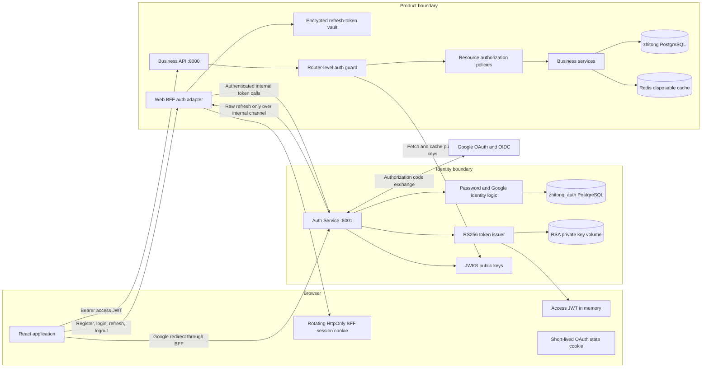
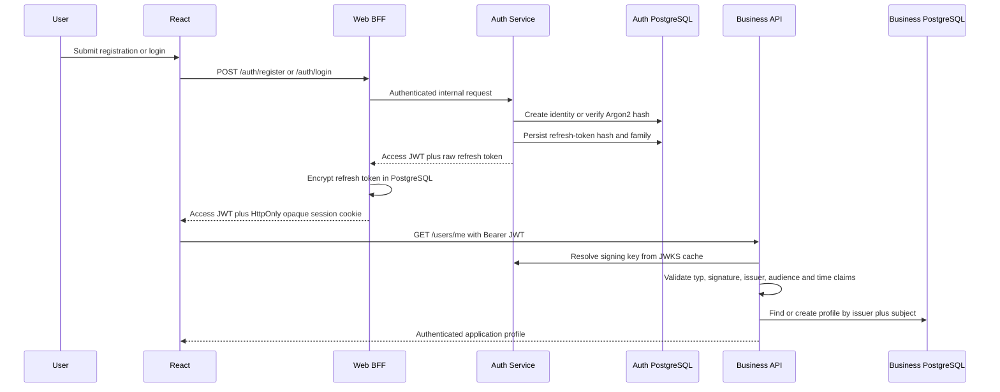
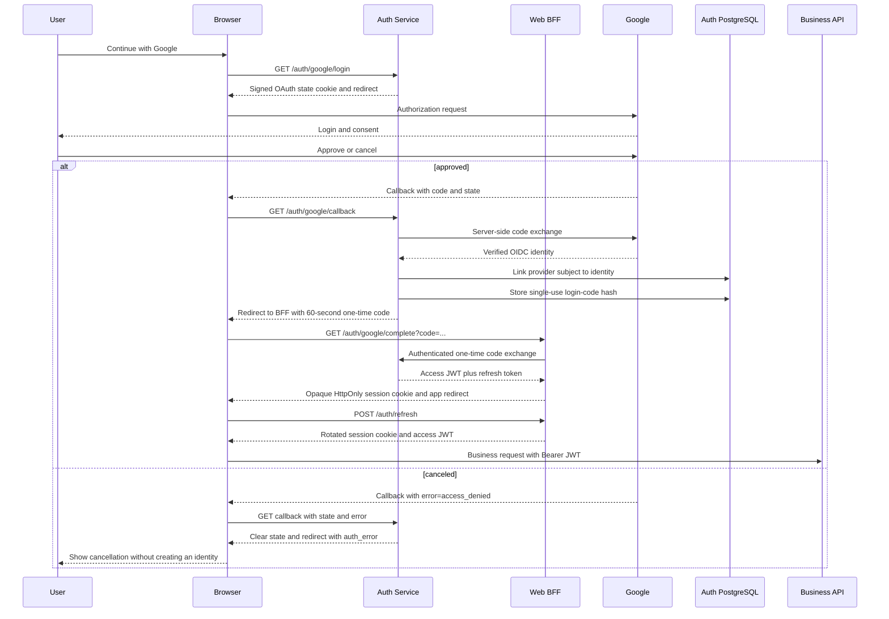
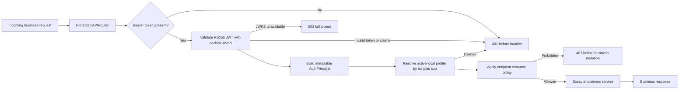
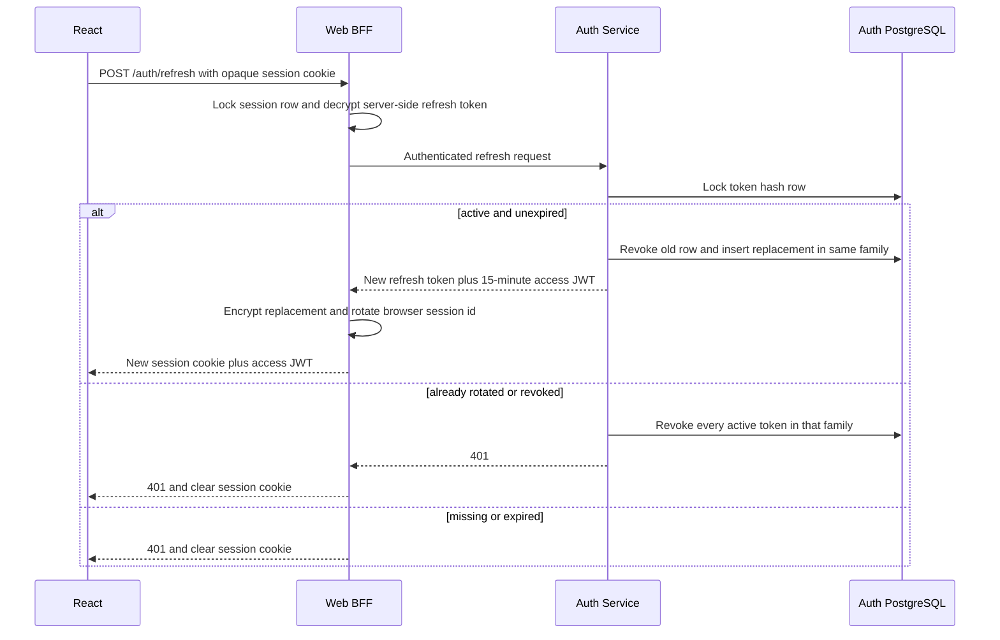
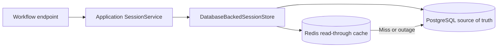

# Zhitong system architecture

## Service and trust boundaries

The private signing key and all credentials stop at the identity boundary. Business API trusts only
tokens that match the configured issuer and audience and verify against Auth Service's public JWKS.
It keys the application profile by the immutable pair `(auth_issuer, auth_subject)` rather than by
email. Email is a mutable display/contact attribute, not the security identifier.

## Data ownership

| Owner | Data | Purpose |
| --- | --- | --- |
| Auth Service database | identity users, password hashes, external provider subjects | Authentication identity |
| Auth Service database | refresh-token hashes, families, expiry and revocation | Rotation and replay response |
| Auth Service database | hashed login identifiers and lock windows | Persistent brute-force throttling |
| Auth Service key store | RSA private/public key pair | Signing access tokens and publishing JWKS |
| Business database | local user/profile linked by issuer + subject | Application-facing representation |
| Business database | encrypted refresh-token vault, application sessions and future domain entities | BFF credential custody and durable product state |
| Redis | cached application-session payloads | Disposable acceleration only |
| Browser memory | short-lived access JWT | Bearer authentication to Business API |
| Browser HTTP-only cookie | opaque rotating BFF session id | Select a server-side refresh credential without exposing it |

Authentication storage exists only in the Auth Service database. The Business database contains the
application-facing user projection, browser-session vault, and independent application sessions; it
does not retain password hashes, provider subjects, or refresh-token ledger rows.

## Password registration and login

Invalid login responses do not reveal whether an email exists. Failures are recorded against a
SHA-256 hash of the normalized identifier and temporarily locked after the configured threshold.

## Google login

Google is an upstream identity provider, not the API credential issuer. Zhitong Auth Service exchanges
the code, validates the Google identity, and issues the same Zhitong access/refresh tokens used by
password login. Google secrets and tokens never enter React JavaScript or query strings.

## Business API request pipeline

All business endpoints are registered on one `APIRouter` with
`dependencies=[Depends(get_current_user)]`. New product routes therefore fail closed unless a developer
consciously mounts a separate public router. Tests inventory OpenAPI operations and assert that every
business operation carries bearer security; only health and the explicit BFF auth routes are public.
Endpoint-specific policies still matter after
authentication; current profile writes use a self-only policy, and future team/project routes should
check membership and role before accessing their service.

## Refresh rotation and replay

Access-token revocation is intentionally bounded by the 15-minute maximum lifetime. Account deletion
also blocks the local business profile immediately. A later phase can add a token-version or
introspection mechanism if the product needs immediate invalidation across all resource servers.

## Application sessions remain separate

Application sessions answer questions such as which onboarding step, draft, filter, or workflow is
active. They never identify the API caller and are never accepted in place of a bearer token. Clearing
Redis loses cached copies only; PostgreSQL remains authoritative.

## Identity-store boundary

The application is pre-production, so the temporary legacy identity bridge has been removed. New
accounts are created directly in Auth PostgreSQL, while the Business `users` row is provisioned from a
verified JWT on first API use. Migration `20260919_0006` removes the former Business password,
Google-subject, and refresh-token storage so future code has one unambiguous authentication owner.
